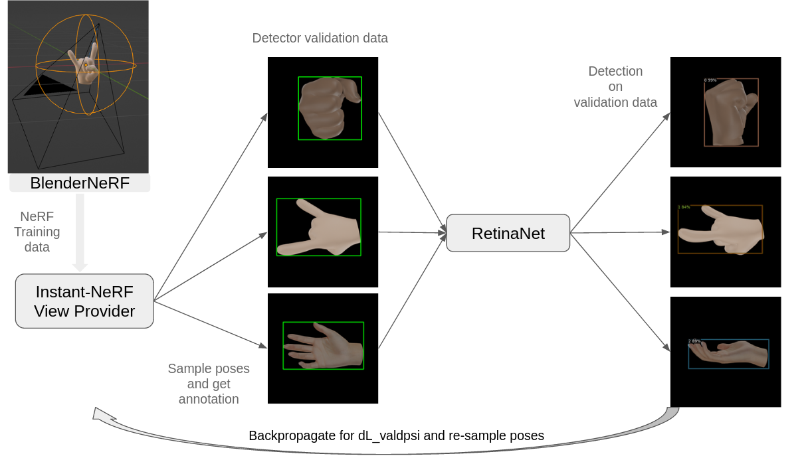
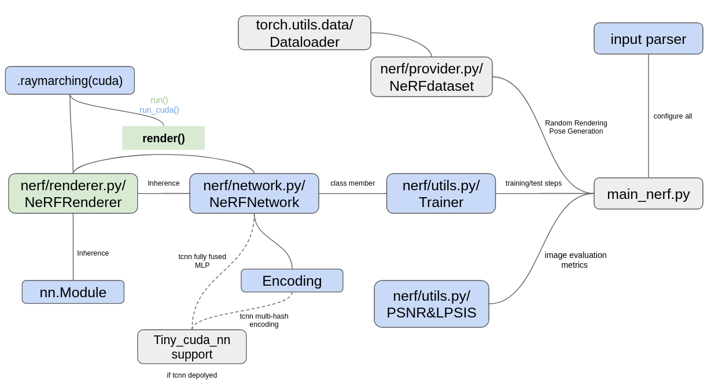
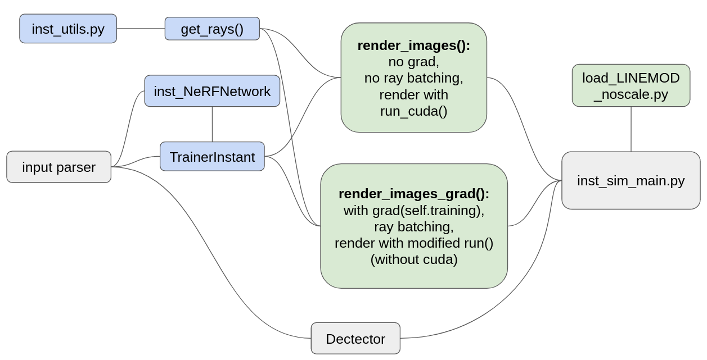

# Course project for Deep learning (263-3210-00L, 2022FS, ETH)
Data Augmentation with Instant-NeRF

This repo is still in actively updating!

## Overview
This is the source code for this course project. Generally speaking, we integrate [Instant-NeRF](https://github.com/NVlabs/instant-ngp) (followed this pytorch [implementaion](https://github.com/ashawkey/torch-ngp)) in the original version of [Neural-Sim](https://github.com/gyhandy/Neural-Sim-NeRF) to facilitate NeRF model training and evaluation step for downstream task. We ran the experiments on a self-generated dataset: hand gesture detection based on BlenderNeRF, to verify the successful integration. 

<div align="center">
    
</div>

<br/>

Note: This project is intended for gaining fundamental knowledge and practical implementaion of NeRFs. Due to the customized implementation of (Instant-) NeRFs, merging two repo is not trivial and a thorough understanding of source code is required. Hence, we want to clarify here that, some modifications are hardcoded and we do not guarantee all terminal flag options work properly as they used to be. But feel free to post any regarding issues! We also post out the code illustration here to help you understanding the pipeline.      

<br /><br />

## Quick start
### 1. Generate training data
We use the [BlenderNerf](https://github.com/maximeraafat/BlenderNeRF) to generate train and test data.

Download our blender [scene file and hand model](https://drive.google.com/file/d/1LNgaFwF1b7Gk2J4h100xNmZyqre-7yyV/view?usp=share_link).

Use COS to generate 100 train and test pictures.

### 2. Train your own nerf
Download our [hand dataset](https://drive.google.com/file/d/1FSAwQpheviDZlX_RjlX8XA9HmPfwNW5E/view?usp=share_link) and extract to `data/` folder.

Train three one by one:
```bash
cd optimization
python train_nerf.py ../data/hand_palm
python train_nerf.py ../data/hand_fist
python train_nerf.py ../data/hand_yeah
```
You can also download our [pre-trained model](https://drive.google.com/file/d/1gYqc0Sf-ymqXjSuiapfkinT9RThVAwbr/view?usp=share_link).

If want to train your own dataset, please refer to [original ngp-torch repo](https://github.com/ashawkey/torch-ngp).

### 3. Train neural-sim model

```bash
python neural_sim_main.py --config ../configs/nerf_param_ycbv_general.txt --object_id 1 --expname  exp_ycb_synthetic --ckpt PATH_TO_YOUR_MODEL(e.g hand_palm)
python neural_sim_main.py --config ../configs/nerf_param_ycbv_general.txt --object_id 2 --expname  exp_ycb_synthetic --ckpt PATH_TO_YOUR_MODEL(e.g hand_fist)
python neural_sim_main.py --config ../configs/nerf_param_ycbv_general.txt --object_id 8 --expname  exp_ycb_synthetic --ckpt PATH_TO_YOUR_MODEL(e.g hand_yeah)
```

## Implementation Detials 
<div align="center">
    
</div>

<br />
Above is the workflow of Instant-NeRF, we mark used files/classes in blue and modified ones in green, which are intended for code integration. Grey boxes are irrelavant to this project or we rewrite with other file to support similar functionalities. 

<br /><br />

<div align="center">
    
</div>

<br />
This is the structure of modified main function of Neural-Sim, which support Instant NeRF's evaluation (<code>render_images()</code>) and with-grad inference (<code>render_images_grad()</code>). These are two critical functions that in charge of rendering images for downstream task, which requires NeRF integration. Some encountered issues during our implementation are listed as followings:

- Both functions starts with sampling from given distributions via intact categorical sampling function from Neural-Sim. Ensuing is configuring render parameteres, which should be modified to be compatible with <code>get_rays()</code> from Instant-NeRF. We extend the <code>render_path()</code> here, which contains rendering computation. Then renderer from TrainerInstant is called for images rendering without batching the rays to maximize the RAM usage. <code>run_cuda()</code> is called here for accelerated rendering.
 
- With gradient inference for Instant-NeRF is bit more envolved with regard to our reference implementation. In details, we need to guarantee the differentiability of the rendering process with respect to the input rays( <code>ray_o && ray_d</code>).Simply turning on <code> self.training</code> (Renderer here is inherited from <code> nn.Module</code>) is not sufficient. We cannot deploy <code> cuda_ray</code> here anymore, due to that some of cuda backend fucntions pertaining to rendering computation don't have customized backward propagation function for pytorch calling. ((<code>_near_far_from_aabb, _march_rays_train</code>) in particular) You might wonder how the training of NeRF is done with cuda-ray deployed (which is our NeRF training settings) and this is because query gradient of NeRF with respent to ray batch is not what actually done in NeRF training. Updating of NeRF parameters is done by query gradient of NeRF with respent to voxels, which is responsible for the differentiability of raymarching computation. Overall, the main caveat here is we don't have a customized backward-able <code> _march_rays_train</code>, which is obatining the marching points inside the volume. This request is redundant for NeRF's training, but essential for obtaining the autograd of NeRF w.r.t to rays and then from rays to poses.<br>
Our solution to above issue is using no-cuda rendering computation for with-grad inference of Instant-NeRF. After analysis of <code>run()</code> in <code> renderer.py</code> and the rendering computation step, we observed that,even though <code>run</code> still calls not backward-able cuda fucntion <code>-near_far_from_aabb()</code>, this computation does not cut off the computation graph of NeRF to rays. Techniquely, it calculates the marching range(near,far) of rays and split this graph into two seperate lobe. Thus, we can simply use <code> torch.no_grad()</code> to detach this computation. By doing this, we need to clarify that using cuda_ray renderer for training NeRF and no_cuda renderer for NeRF evaluation is permitted. To our knowledge, the computation of raymarching is an unbiased rendering algorithm (omitting the bias of MC-NUmerical Integration for expotential transmittance computation at high marching resolution), two different implementations for this algorithm should both converge to one image with a fixed scene (a fixed NeRF), given the same rendering arguments. It turns out that we can get visually identical rendering results with above operation, which validates our guess.

<br /><br />

### Configuartion details

- Instant NeRF is pretrained and loaded into Neural-Sim's pipeline with saved checkpoint file. Since we need to first initialize the Instant NeRF network and call <code> load_ckeckpoint()</code> on <code> .pth</code> files to reload Instant-NeRF model in Neural-Sim. Model reload could be impaired by wrong configuration for Instant NeRF network initialization, becuase parameters of encoding layer might depend on these arguments. So,we need to guarantee the NeRF training arguments consistent with those for Neural-sim configurations (e.g bound and scale).

- Another possible configuration conflict could happen in camera pose sampling step. We need to modify <code>load_LINMOD_noscale.py</code> for loading camera intrinscs from training/testing data <code>.json</code> files to <code>render_image()</code>. Besides, camera poses (camera_to_world [4 * 4] matrix) sampled from <code>sample_poses()</code> are not compatible with our settings. The default radius should be changed to the BlenderNeRF generator parameters (this cannot be done with parser, so we hardcode this). The rotation part of the sampled poses is also not compatible to our dataset, becaese we observed that the inital camera pose of Neural-Sim is different from our generation setting. By tedious experiments, we rectified this error by reverse the directions of all rays.


<br /><br />
## Reproducing experiments


## Installation
### 1. Clone the repo
```bash
git clone --recursive https://github.com/thisiszy/Neural-Sim-NeRF.git
```

### 2. Virtual environment
Tested on Python/3.10.4 with gcc/8.2.0, cuda/11.7.0, nccl/2.11.4-1, cudnn/8.2.1.32

```bash
cd Neural-Sim-NeRF
python -m venv venv
source venv/bin/activate
./install.sh
```
